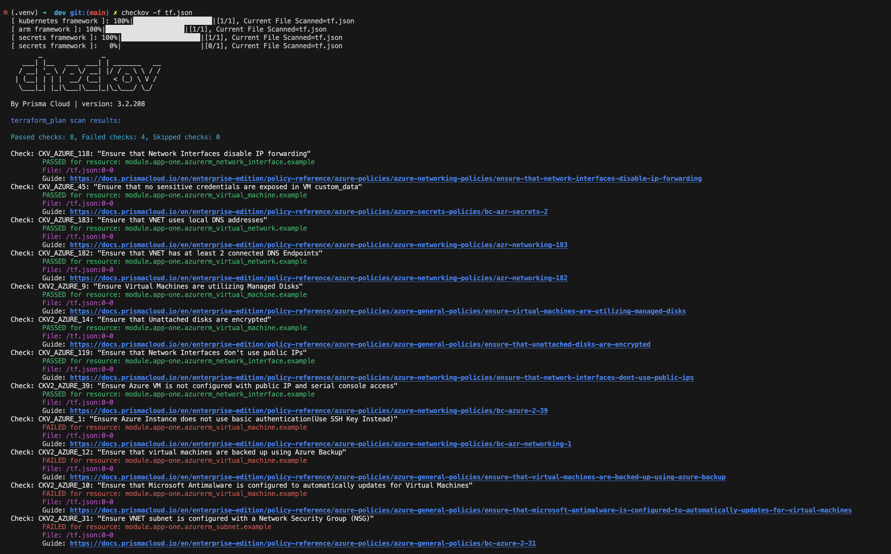

# Checkov overview

Using checkov to apply policies to the Terraform infrastructure code for Azure Cloud


## Terraform and Azure

### Creating the backend infrastructure

- Creating the resource group

```bash
$ az group create --name az-weu-checkov-demo-rg --location westeurope
# Result:
{
  "id": "/subscriptions/5bf630ed-fa43-46b5-94b2-a0fdf571e2bc/resourceGroups/az-weu-checkov-demo-rg",
  "location": "westeurope",
  "managedBy": null,
  "name": "az-weu-checkov-demo-rg",
  "properties": {
    "provisioningState": "Succeeded"
  },
  "tags": null,
  "type": "Microsoft.Resources/resourceGroups"
}
```

- Creating the storage account
```bash
$ az storage account create --name azweucheckovdemost --resource-group az-weu-checkov-demo-rg --location eastus --sku Standard_LRS
# Result:
{
  "accessTier": "Hot",
  "accountMigrationInProgress": null,
  "allowBlobPublicAccess": false,
  "allowCrossTenantReplication": false,
  "allowSharedKeyAccess": null,
  "allowedCopyScope": null,
  "azureFilesIdentityBasedAuthentication": null,
  "blobRestoreStatus": null,
  "creationTime": "2024-07-25T17:32:53.181359+00:00",
  "customDomain": null,
  "defaultToOAuthAuthentication": null,
  "dnsEndpointType": null,
  "enableHttpsTrafficOnly": true,
  "enableNfsV3": null,
  "encryption": {
    "encryptionIdentity": null,
    "keySource": "Microsoft.Storage",
    "keyVaultProperties": null,
    "requireInfrastructureEncryption": null,
    "services": {
      "blob": {
        "enabled": true,
        "keyType": "Account",
        "lastEnabledTime": "2024-07-25T17:32:53.696983+00:00"
      },
      "file": {
        "enabled": true,
        "keyType": "Account",
        "lastEnabledTime": "2024-07-25T17:32:53.696983+00:00"
      },
      "queue": null,
      "table": null
    }
  },
  "extendedLocation": null,
  "failoverInProgress": null,
  "geoReplicationStats": null,
  "id": "/subscriptions/5bf630ed-fa43-46b5-94b2-a0fdf571e2bc/resourceGroups/az-weu-checkov-demo-rg/providers/Microsoft.Storage/storageAccounts/azweucheckovdemost",
  "identity": null,
  "immutableStorageWithVersioning": null,
  "isHnsEnabled": null,
  "isLocalUserEnabled": null,
  "isSftpEnabled": null,
  "isSkuConversionBlocked": null,
  "keyCreationTime": {
    "key1": "2024-07-25T17:32:53.306357+00:00",
    "key2": "2024-07-25T17:32:53.306357+00:00"
  },
  "keyPolicy": null,
  "kind": "StorageV2",
  "largeFileSharesState": null,
  "lastGeoFailoverTime": null,
  "location": "eastus",
  "minimumTlsVersion": "TLS1_0",
  "name": "azweucheckovdemost",
  "networkRuleSet": {
    "bypass": "AzureServices",
    "defaultAction": "Allow",
    "ipRules": [],
    "ipv6Rules": [],
    "resourceAccessRules": null,
    "virtualNetworkRules": []
  },
  "primaryEndpoints": {
    "blob": "https://azweucheckovdemost.blob.core.windows.net/",
    "dfs": "https://azweucheckovdemost.dfs.core.windows.net/",
    "file": "https://azweucheckovdemost.file.core.windows.net/",
    "internetEndpoints": null,
    "microsoftEndpoints": null,
    "queue": "https://azweucheckovdemost.queue.core.windows.net/",
    "table": "https://azweucheckovdemost.table.core.windows.net/",
    "web": "https://azweucheckovdemost.z13.web.core.windows.net/"
  },
  "primaryLocation": "eastus",
  "privateEndpointConnections": [],
  "provisioningState": "Succeeded",
  "publicNetworkAccess": null,
  "resourceGroup": "az-weu-checkov-demo-rg",
  "routingPreference": null,
  "sasPolicy": null,
  "secondaryEndpoints": null,
  "secondaryLocation": null,
  "sku": {
    "name": "Standard_LRS",
    "tier": "Standard"
  },
  "statusOfPrimary": "available",
  "statusOfSecondary": null,
  "storageAccountSkuConversionStatus": null,
  "tags": {},
  "type": "Microsoft.Storage/storageAccounts"
}

```
- Creating a storage container
```bash
$ az storage container create --name tfstate --account-name azweucheckovdemost
# Result:
There are no credentials provided in your command and environment, we will query for account key for your storage account.
It is recommended to provide --connection-string, --account-key or --sas-token in your command as credentials.

You also can add `--auth-mode login` in your command to use Azure Active Directory (Azure AD) for authorization if your login account is assigned required RBAC roles.
For more information about RBAC roles in storage, visit https://docs.microsoft.com/azure/storage/common/storage-auth-aad-rbac-cli.

In addition, setting the corresponding environment variables can avoid inputting credentials in your command. Please use --help to get more information about environment variable usage.
{
  "created": true
}
```


After the backend infrastructure configured, let's setup checkov. There are many ways to install and use checkov, I'm going to show how to do it using python
- Terraform is required
- Python is required (I'm using v3.12)
- Create and activate a python virtual environment 
```bash
$ python3.12 -m venv .venv
$ source .venv/bin/activate
```
- Install checkov
```bash
$ pip install checkov
```

After this setup we're ready to run checkov, let's create a terraform code. Terraform code is not the objective here, then there are some dirty code, it can be improved afterwards, but the main point here is how to enforce policies to the IaaC code.

First I'm going to create a small module called app-one, that will create a new Resource Group, Virtual Network and a Virtual Machine.

- src/modules/app-one/main.tf 

```hcl 
provider "azurerm" {
  features {}
}

resource "azurerm_resource_group" "example" {
  name     = var.resource_group_name
  location = var.location
}

resource "azurerm_virtual_network" "example" {
  name                = var.vnet_name
  address_space       = [var.vnet_address_space]
  location            = azurerm_resource_group.example.location
  resource_group_name = azurerm_resource_group.example.name
}

resource "azurerm_subnet" "example" {
  name                 = var.subnet_name
  resource_group_name  = azurerm_resource_group.example.name
  virtual_network_name = azurerm_virtual_network.example.name
  address_prefixes     = [var.subnet_address_prefix]
}

resource "azurerm_network_interface" "example" {
  name                = var.nic_name
  location            = azurerm_resource_group.example.location
  resource_group_name = azurerm_resource_group.example.name

  ip_configuration {
    name                          = "internal"
    subnet_id                     = azurerm_subnet.example.id
    private_ip_address_allocation = "Dynamic"
  }
}

resource "azurerm_virtual_machine" "example" {
  name                  = var.vm_name
  location              = azurerm_resource_group.example.location
  resource_group_name   = azurerm_resource_group.example.name
  network_interface_ids = [azurerm_network_interface.example.id]
  vm_size               = var.vm_size

  storage_image_reference {
    publisher = "Canonical"
    offer     = "UbuntuServer"
    sku       = "18.04-LTS"
    version   = "latest"
  }

  storage_os_disk {
    name              = "${var.vm_name}_os_disk"
    caching           = "ReadWrite"
    create_option     = "FromImage"
    managed_disk_type = "Standard_LRS"
  }

  os_profile {
    computer_name  = var.vm_name
    admin_username = var.admin_username
    admin_password = var.admin_password
  }

  os_profile_linux_config {
    disable_password_authentication = false
  }
}


```

- src/modules/app-one/variables.tf 

```hcl 
variable "resource_group_name" {
  description = "The name of the resource group"
  type        = string
}

variable "location" {
  description = "The Azure region where resources will be created"
  type        = string
}

variable "vnet_name" {
  description = "The name of the virtual network"
  type        = string
}

variable "vnet_address_space" {
  description = "The address space for the virtual network"
  type        = string
}

variable "subnet_name" {
  description = "The name of the subnet"
  type        = string
}

variable "subnet_address_prefix" {
  description = "The address prefix for the subnet"
  type        = string
}

variable "nic_name" {
  description = "The name of the network interface"
  type        = string
}

variable "vm_name" {
  description = "The name of the virtual machine"
  type        = string
}

variable "vm_size" {
  description = "The size of the virtual machine"
  type        = string
}

variable "admin_username" {
  description = "The admin username for the virtual machine"
  type        = string
}

variable "admin_password" {
  description = "The admin password for the virtual machine"
  type        = string
  sensitive   = true
}

```
Then I will create a new workspace that will use the backend infrastructure and use the module to provision the app-one infrastructure.

- Under src/workspaces/dev create a main.tf file

```hcl
terraform {
    required_providers {
      azurerm = {
        source  = "hashicorp/azurerm"
        version = "=3.0.0"
      }
    }

    backend "azurerm" {
      resource_group_name   = "az-weu-checkov-demo-rg"
      storage_account_name  = "azweucheckovdemost"
      container_name        = "tfstate"
      key                   = "checkov.terraform.tfstate"
      
    }
}


module "app-one" {
  source = "../../modules/app-one"
  resource_group_name = "myResourceGroup"
  location            = "eastus"
  vnet_name           = "myVnet"
  vnet_address_space  = "10.0.0.0/16"
  subnet_name         = "mySubnet"
  subnet_address_prefix = "10.0.1.0/24"
  nic_name            = "myNic"
  vm_name             = "myVM"
  vm_size             = "Standard_DS1_v2"
  admin_username      = "azureuser"
  admin_password      = "P@ssw0rd1234!"
}

provider "azurerm" {
  features {}
}
```

## Checkov

After the code is ready, let's init the terraform code and run checkov:

```bash
# Check if you are under the root folder of the project
$ pwd
/Users/rafael/GitHub/demo-checkov

# Go to the workspace folder
$ cd /src/workspaces/dev
$ terraform init
$ terraform plan -out tf.plan
$ terraform show -json tf.plan > tf.json
```

Now with the plan ready, let's run the checkov using the default policies configuration:

```bash
$ checkov -f tf.json
```

